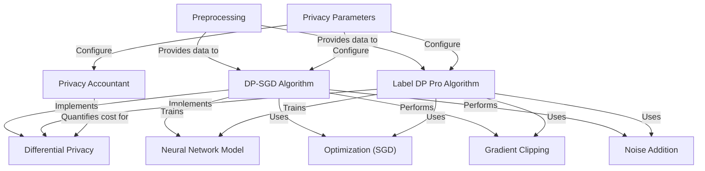
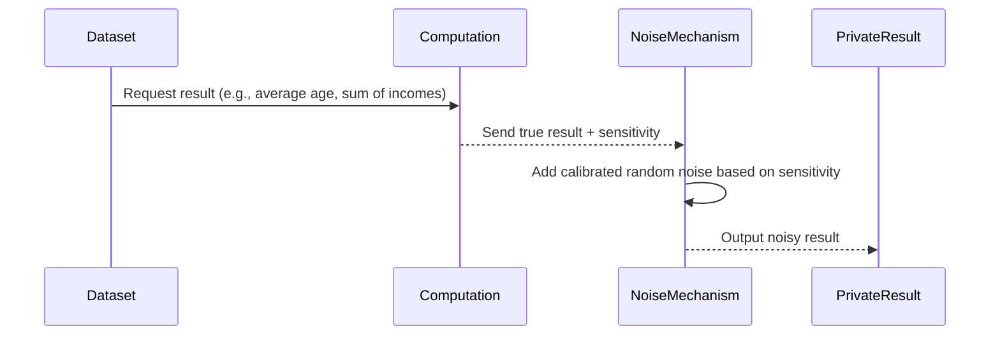
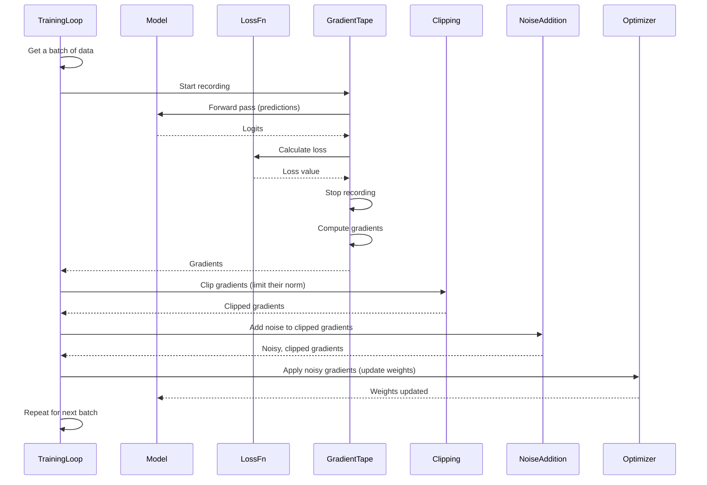
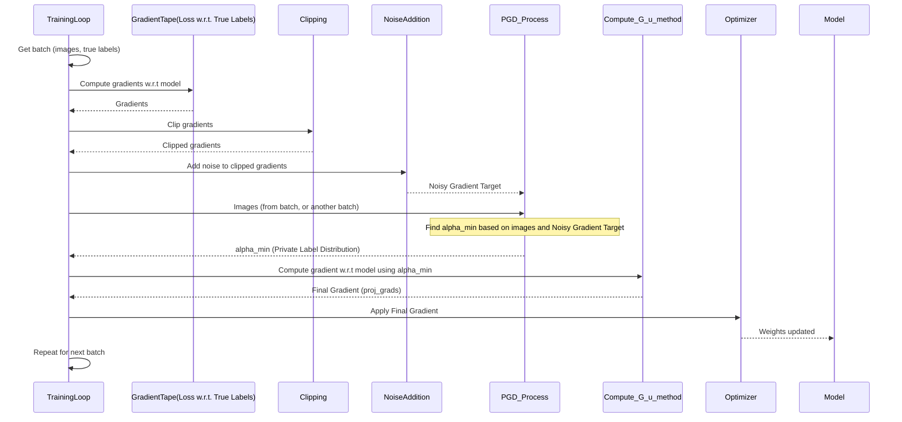
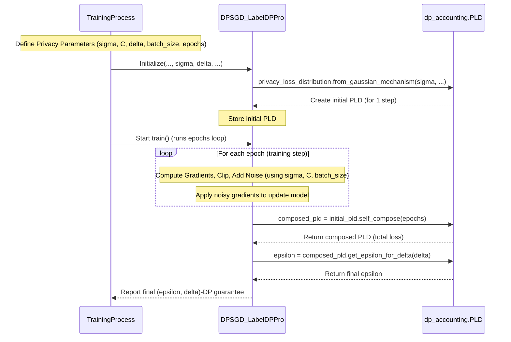

# Privacy Preservation in Deep Learning

This project explores methods for training neural networks with **differential privacy**
to protect sensitive training data. It implements two main *privacy-preserving* algorithms,
**DP-SGD** and **Label DP Pro**, which modify standard **optimization** techniques
by applying **gradient clipping** and **noise addition**. These algorithms are configured
using **privacy parameters**, and the privacy guarantee is quantified by a **privacy accountant**
during training of the **neural network model** on **preprocessed** data.


## Visual Overview



# Differential Privacy

Imagine we've trained our model using SGD on the MNIST dataset. The model can now classify handwritten digits pretty well! But there's a potential problem: even though the model only outputs predictions (like "this image is a 4"), the way it learned might have memorized specific details about the *exact* images it was trained on.

This is where **Differential Privacy** comes in. It's a powerful concept that aims to train machine learning models while ensuring that the trained model does not reveal sensitive information about any individual data point used in training.

## What Problem Does Differential Privacy Solve?

Each image and its label come from a real person. A standard neural network trained with SGD could, in theory, learn something unique about a specific person's handwriting style, even if that person only contributed *one* image to the huge training dataset. If someone later analyzed the trained model very carefully, they *might* be able to infer whether a specific individual's data was included in the training set, or even some unique characteristic of their data. This could be a privacy risk, especially with more sensitive datasets.

The core use case Differential Privacy addresses is:

**Train a machine learning model on a dataset containing individuals' data, ensuring that the final trained model's behavior doesn't reveal much about any single individual in the dataset.**

It's like trying to learn about the *general patterns* of handwriting from many people, but making it impossible to zoom in on the "blur" and identify or learn specific traits of any *one* person's handwriting that was part of the training.

## Measuring Privacy: Epsilon (ε) and Delta (δ)

Differential Privacy provides a mathematical way to quantify this indistinguishability using two parameters: **Epsilon (ε)** and **Delta (δ)**.

*   **Epsilon (ε):** This is the primary privacy parameter. It controls the strength of the privacy guarantee.
    *   A smaller ε means stronger privacy (the output is *more* indistinguishable between datasets A and B). This is like adding more "blur" in our analogy.
    *   A larger ε means weaker privacy (the output can be *more* different). Less "blur".
    *   ε is usually a positive number, often ranging from less than 1 to up to 10 or more, depending on the application and desired privacy level.

*   **Delta (δ):** This parameter accounts for a small probability that the privacy guarantee might *not* hold.
    *   δ is typically set to be very small, often less than the inverse of the dataset size (e.g., 10⁻⁵ or 10⁻⁶ for a dataset of 100,000 records).
    *   Think of δ as the acceptable chance of failure. "With probability 1-δ, the output is ε-differentially private." It handles cases that are theoretically possible but extremely unlikely to violate privacy.

An algorithm satisfying **(ε, δ)-Differential Privacy** provides a strong guarantee: for any two datasets that differ by only one individual's record, and for any possible output of the algorithm, the probability of getting that output from one dataset is not much different from the probability of getting it from the other dataset. The "not much different" is quantified by ε and δ.

## How is Differential Privacy Achieved in Machine Learning?

The most common way to achieve differential privacy in algorithms that compute on data is by **adding random noise** to the computation results. The amount of noise added is carefully calibrated based on how much a single individual's data could potentially influence the result (this is called **sensitivity**).

In our project, the core idea is to apply this noise-adding mechanism to the **gradients** calculated during the SGD optimization process. The gradient tells us how to update the model's weights based on a batch of data. If a single person's data significantly changes the gradient, adding noise helps mask that individual contribution.

## Under the Hood: DP Principle in Action (High Level)

Let's visualize the basic principle of how differential privacy is often achieved in a computation that calculates a value from a dataset.



In this simple example, instead of directly outputting the "true" result calculated from the dataset, random noise is added. The amount of noise depends on the *sensitivity* – how much the true result would change if one person's data was slightly different or removed. Adding noise proportional to this sensitivity masks individual contributions.

Our project applies this principle, but the "computation" is the gradient calculation in SGD, and the "result" we add noise to is the gradient itself.


## Key Concepts of DP-SGD

DP-SGD modifies the standard SGD process by adding two main steps *after* computing the gradient for a batch, but *before* updating the model's weights:

1.  **Gradient Clipping:** This step limits how large the gradient from any single training example (or, more practically in some implementations, from a batch) can be. This prevents outliers (unusual data points) from having an excessively large influence on the model update.
2.  **Noise Addition:** After clipping, carefully calibrated random noise is added to the aggregated gradient. This noise helps to mask the individual contributions within the batch, ensuring that the final gradient used for the update doesn't reveal too much about any specific data point.

By performing these two operations at each step of the optimization process, DP-SGD ensures that the model learns the overall patterns in the data without "memorizing" or being overly sensitive to individual data points, thereby achieving Differential Privacy.

## Using DP-SGD in Code

In our project, the `DPSGD` class is specifically designed to implement this algorithm. When you create an instance of this class and call its `train()` method, it performs the training using the DP-SGD modifications.

Let's look at how the `DPSGD` class is initialized (from the `DP-SGD.ipynb` notebook):

```python
# Create an instance of the Preprocessing class (from Chapter 1)
data_prep = Preprocessing()
train_data = data_prep.get_train_data()
test_data = data_prep.get_test_data()
val_data = data_prep.get_val_data()

# Initialize the DPSGD class
noisy_model = DPSGD(train_data, val_data, test_data, sigma=7, batch_size=512)

# Start the training process
# TrLS_noisy, VlLS_noisy, ... = noisy_model.train()
```

The `DPSGD` class takes several parameters upon initialization:

*   `train_data`, `val_data`, `test_data`: These are the preprocessed datasets obtained from the `Preprocessing` class.
*   `sigma`: This is a crucial privacy parameter related to the amount of noise added. A higher `sigma` means more noise and stronger privacy (but potentially lower model accuracy).
*   `batch_size`: The size of the batches used in SGD, similar to standard SGD. This also plays a role in the privacy accounting.
*   `delta`: A small privacy parameter (usually very close to zero) that accounts for a tiny probability of privacy failure.

The `train()` method then orchestrates the entire training process for a specified number of epochs (defaulting to 1000 in the provided code), applying the DP-SGD steps in each batch iteration.

## Under the Hood: How DP-SGD Modifies the Training Loop

Standard SGD Batch Loop:
1.  Get a batch of data.
2.  Calculate the loss for the batch.
3.  Compute the gradients (how much to change weights to reduce loss).
4.  Apply the gradients to update model weights.

DP-SGD Batch Loop:
1.  Get a batch of data.
2.  Calculate the loss for the batch.
3.  Compute the gradients.
4.  **Clip the gradients.**
5.  **Add noise to the clipped gradients.**
6.  Apply the *noisy, clipped* gradients to update model weights.

Here's a simple sequence diagram illustrating this DP-SGD flow:



## Under the Hood: DP-SGD Steps in Code

The core DP-SGD logic happens inside the `train` method of the `DPSGD` class. Let's look at the relevant snippets, building upon the standard SGD code.

```python
# --- Inside the train method of the DPSGD class ---
# (Simplified for focus on DP-SGD steps)

for epoch in range(self.epochs):
    # Get a batch (shuffling and batching handled here)
    batch = self.train_data.shuffle(buffer_size=54000).batch(self.batch_size)
    images, labels = next(iter(batch))

    # 1. Start recording operations
    with tf.GradientTape() as tape:
        # 2. Forward pass: get predictions (logits)
        predict = self.model(images, training=True)
        # 3. Calculate the loss (error)
        loss = self.loss_fn(labels, predict)

    # 4. Compute gradients w.r.t. model variables
    grads = tape.gradient(loss, self.model.trainable_variables)

    # --- DP-SGD Steps ---

    # 5. Clip the gradients
    # self.C is the clipping norm parameter (set in __init__)
    clipped_grads = [tf.clip_by_norm(g, clip_norm=self.C) for g in grads]
    # (Details in Chapter 7: Gradient Clipping)

    # 6. Add noise to the clipped gradients
    noisy_grads = []
    for g in clipped_grads:
        # Noise scale is proportional to clipping norm (self.C) and noise multiplier (self.sigma)
        noise = tf.random.normal(
            shape=g.shape,
            stddev=self.sigma * self.C
        )
        # Note: Noise might be scaled by batch_size in some implementations,
        # but here it's added directly scaled by sigma*C per gradient element.
        # The division by batch_size is applied to the noise term itself in this code.
        noisy_grad = g + noise / self.batch_size # Add noise to the clipped gradient
        noisy_grads.append(noisy_grad)
    # (Details in Chapter 8: Noise Addition)

    # --- End DP-SGD Steps ---

    # 7. Apply the noisy, clipped gradients to update model weights
    self.optimizer.apply_gradients(zip(noisy_grads, self.model.trainable_variables))

    # ... (Metrics calculation and logging happen here) ...
```

# Private Label Distribution

The central idea of the Label DP Pro Algorithm is to use the *noisy* gradient (calculated based on the true labels but with noise added) not as the final gradient for the update, but as a *guide*. It uses this noisy guide to find a "privacy-friendly" distribution over the possible output labels for each training example. The model is then updated using the gradient calculated with respect to this newly found, private label distribution.

Think of it like this:
*   In standard SGD, the model gets feedback based directly on the correct answer (true label).
*   In DP-SGD, the feedback based on the correct answer is slightly blurred/noisy, and the model adjusts based on that blurred feedback.
*   In Label DP Pro, the feedback based on the correct answer is blurred/noisy. The model *interprets* this noisy feedback to figure out a slightly different, "private" set of probabilities for what the correct answer *might* be (the private label distribution), and then it adjusts based on *this interpreted, private plan*.

The "private label distribution" for a training image is a set of numbers (that sum to 1) indicating the probability of that image belonging to each possible class (0-9 in our MNIST example). Instead of the true label (e.g., [0,0,0,1,0,0,0,0,0,0] for a '3'), the private distribution might be something like [0.01, 0.01, 0.02, 0.8, 0.05, 0.05, 0.01, 0.02, 0.02, 0.01] – still heavily leaning towards '3', but distributing some probability mass to other classes in a privacy-aware way.

## Key Concepts

1.  **Noisy Gradient (as a Target):** Unlike DP-SGD, the gradient calculated from the true labels, clipped, and noised isn't directly used for the weight update. It serves as a target or reference.
2.  **Private Label Distribution (`alpha_min`):** For each image in a batch, the algorithm finds a distribution over the possible classes (a vector of 10 probabilities for MNIST) that is influenced by the input image and the noisy gradient target. This distribution is called `alpha_min` in the code.
3.  **Projected Gradient Descent (PGD):** A sub-process, often involving multiple steps itself, is used to find this `alpha_min` distribution for each image in a batch. This PGD process tries to find an `alpha_min` that minimizes the difference between the gradient calculated using `alpha_min` and the noisy gradient target.
4.  **Gradient w.r.t. Private Labels:** The final gradient used to update the model's weights is calculated based on the input images and the derived `alpha_min` distributions, not the original true labels.

## Using the Label DP Pro Algorithm

In this project, the `Label_DP_Pro` class implements this algorithm. Similar to the `DPSGD` class, you initialize it with your data and privacy parameters, then call its `train()` method.

Here's how it's used in the provided notebooks (`Label DP Pro ALTConv.ipynb` and `Label DP Pro SELFConv.ipynb`):

```python
# Create an instance of the Preprocessing class (from Chapter 1)
data_prep = Preprocessing()
train_data = data_prep.get_train_data()
test_data = data_prep.get_test_data()
val_data = data_prep.get_val_data()

# Initialize the Label_DP_Pro class
# The model architecture is the same Simple_NN as in Chapter 2
model = Label_DP_Pro(train_data, val_data, test_data, sigma=7, batch_size=512)

# Start the training process
train_loss_scores, valid_loss_scores, train_acc_scores, valid_acc_scores, test_acc_scores, epochs = model.train()
```

Notice that the initialization looks very similar to the `DPSGD` class. It also takes `sigma`, `batch_size`, and `delta` as parameters related to privacy.

The `train()` method then runs the training loop, incorporating the unique steps of the Label DP Pro algorithm.

## Under the Hood: How Label DP Pro Modifies the Training Loop

Let's compare the simplified flow from DP-SGD with the flow for Label DP Pro:

**DP-SGD Batch Loop:**
1.  Get a batch of data (images, true labels).
2.  Calculate the loss for the batch (using true labels).
3.  Compute gradients (w.r.t model weights).
4.  Clip the gradients.
5.  Add noise to the clipped gradients -> **Noisy Gradients**.
6.  Apply the **Noisy Gradients** to update model weights.

**Label DP Pro Batch Loop:**
1.  Get a batch of data (images, true labels).
2.  Calculate the loss for the batch (using true labels).
3.  Compute gradients (w.r.t model weights).
4.  Clip the gradients.
5.  Add noise to the clipped gradients -> **Noisy Gradient Target**.
6.  Use images and the **Noisy Gradient Target** to find a **Private Label Distribution** (`alpha_min`).
7.  Calculate the *final* gradient using images and the **Private Label Distribution** (`alpha_min`).
8.  Apply the *final* gradient to update model weights.

Here's a simplified sequence diagram focusing on the unique part:


*(Note: The PGD process is complex internally, involving multiple steps and gradient calculations not shown here for simplicity. `Compute_G_u` calculates the gradient of the loss where labels are replaced by the `alpha_min` distribution.)*

## Under the Hood: Unique Code Steps

Let's look at snippets from the `train` method of the `Label_DP_Pro` class that differ from or are added to the standard DP-SGD flow.

First, calculating the noisy gradient target (steps similar to DP-SGD):

```python
# --- Inside the train method of the Label_DP_Pro class ---

# (Simplified for focus on unique steps)
for epoch in range(self.epochs):
    # Get a batch (shuffling and batching handled here)
    batch = self.train_data.shuffle(buffer_size=54000).batch(self.batch_size)
    images, labels = next(iter(batch)) # Get images and TRUE labels

    # Compute gradients w.r.t. model variables using TRUE labels
    with tf.GradientTape() as tape:
        predict = self.model(images, training=True) # predictions
        loss = self.loss_fn(labels, predict) # loss using TRUE labels
    grads = tape.gradient(loss, self.model.trainable_variables)

    # Clip the gradients (similar to DP-SGD)
    clipped_grads = [tf.clip_by_norm(g, clip_norm=self.C) for g in grads]

    # Add noise to the clipped gradients -> this is the TARGET
    noisy_grads = []
    for g in clipped_grads:
        noise = tf.random.normal(
            shape=g.shape,
            stddev=self.sigma * self.C # Noise scaled by sigma and clipping norm C
        )
        # Noise added to the clipped gradient, scaled by batch size
        noisy_grad = g + noise/self.batch_size
        noisy_grads.append(noisy_grad)

    # --- Label DP Pro Specific Steps ---

    # Get potentially another batch of images (alt_images in the code)
    # The provided code uses a separate shuffled batch for alt_images in ALTConv.ipynb
    # and the same batch 'images' in SELFConv.ipynb.
    # Let's assume the same batch for simplicity in this walk-through (like SELFConv.ipynb)
    alt_images = images # or get another batch like alt_batch = self.train_data.shuffle(...).batch(...); alt_images, _ = next(iter(alt_batch))

    # Find the private label distribution (alpha_min) using PGD
    # This is the core unique step, explained below
    alpha_min = self.PGD(alt_images, noisy_grads)

    # Compute the FINAL gradient using the alt_images and the derived alpha_min
    # This is a method within the class, explained below
    proj_grads = self.Compute_G_u(alt_images, alpha_min)

    # --- End Label DP Pro Specific Steps ---

    # Apply the FINAL gradient (proj_grads) to update model weights
    self.optimizer.apply_gradients(zip(proj_grads, self.model.trainable_variables))

    # ... (Metrics calculation and logging happen here) ...
```

The crucial new steps are the call to `self.PGD()` and the subsequent calculation using `self.Compute_G_u()`.

Let's peek into the `PGD` method:

```python
# --- Inside the Label_DP_Pro class ---
def PGD(self, images, noisy_grads, num_steps=20, step_size=0.05):
    # This method finds alpha_min for the given images and noisy_grads target
    # It's a form of Projected Gradient Descent on the label distribution (alpha)
    batch_size = tf.shape(images)[0]
    num_classes = 10
    alpha_shape = (batch_size, num_classes)
    # Initialize alpha (the label distribution we are optimizing)
    # Started as uniform distribution for each image, scaled
    alpha = tf.Variable(tf.ones(alpha_shape, dtype=tf.float32) / tf.cast(num_classes*batch_size, tf.float32), trainable=True)

    for _ in range(num_steps): # Multiple steps within PGD
        # Compute gradient of the loss w.r.t model weights using the current alpha
        G_alpha = self.Compute_G_u(images, alpha)
        # Calculate the difference between this gradient and the noisy gradient target
        diff = [g - ng for g, ng in zip(G_alpha, noisy_grads)]
        # Calculate gradient w.r.t alpha based on this difference (this is the tricky part involving Compute_G_T_v)
        grad_alpha = self.Compute_G_T_v(images, diff)
        # Update alpha using its gradient
        alpha.assign_sub(2* step_size * grad_alpha) # Update step for alpha
        # Project alpha to be a valid distribution (non-negative, sums to 1 per image)
        alpha.assign(self.project(alpha))

    return alpha # Return the final alpha_min found
```

This PGD method is essentially performing an optimization *within* each training step. It's optimizing the label distribution `alpha` for each image in the batch. The goal is to find an `alpha` such that the gradient computed using that `alpha` (`G_alpha`) is as close as possible to the `noisy_grads` target, while also ensuring `alpha` remains a valid probability distribution (using the `project` function).

The `project` function ensures that for each image's label distribution (a row in the `alpha` tensor), the values are non-negative and sum up to 1. This ensures that `alpha_min` is a valid distribution over labels.

Finally, `Compute_G_u` is used to get the *actual* gradient applied to the model:

```python
# --- Inside the Label_DP_Pro class ---
def Compute_G_u(self, images, u):
    # Computes the gradient of the loss w.r.t. model variables
    # where 'u' is the label distribution for each image
    with tf.GradientTape() as tape:
        logits = self.model(images) # Get predictions
        # Calculate loss using the distribution 'u' instead of one-hot true labels
        # log_softmax is used, then weighted sum with u, then mean
        loss = tf.nn.log_softmax(logits, axis=-1)
        loss_w = -tf.reduce_mean(u*loss) # Weighted mean loss based on distribution u
    G_u = tape.gradient(loss_w, self.model.trainable_variables) # Gradient w.r.t model variables
    return G_u # This is the gradient applied by the optimizer
```

This method is key because it shows how the model update gradient (`G_u` or `proj_grads` in the `train` loop) is calculated using the derived `alpha_min` distribution (`u`) instead of the original true labels.

In summary, the Label DP Pro Algorithm adds noise not to the gradient used for the final update, but to a gradient used as a target in a separate optimization process (PGD). This PGD process finds a 'private' label distribution (`alpha_min`), and the final update gradient is computed based on this private distribution.

# Privacy Accountant

1.  **Privacy Loss Distribution (PLD):** Instead of just tracking a single \(\epsilon\) value for one step, the `dp_accounting` library uses a more sophisticated concept called the Privacy Loss Distribution. Think of it as a distribution over all possible *privacy losses* that could occur from a single differentially private operation (like processing one batch with noise). It's a richer representation than just \(\epsilon\).
2.  **Composition:** This is the mathematical process of combining the privacy guarantees of multiple differentially private operations. If you run a DP algorithm multiple times, the total privacy guarantee weakens. The accountant performs the calculations (often based on advanced techniques like the Moments Accountant or Fourier Accountant) to determine the combined PLD after many steps.
3.  **Calculating Epsilon from PLD and Delta:** Once the total Privacy Loss Distribution (the composed PLD) is calculated for the entire process, we can then query this distribution to find the corresponding \(\epsilon\) for a specific, desired small value of \(\delta\).

## Using the Privacy Accountant in Code

The Privacy Accountant is integrated into the `DPSGD` and `Label_DP_Pro` classes in our project.

First, an instance of the privacy accounting tool is created when the training class is initialized. This object is configured based on the privacy parameters chosen for *each step*.

```python
# --- Inside the __init__ method of the DPSGD or Label_DP_Pro class ---
    def __init__(self, train_data, val_data, test_data, sigma, batch_size, delta=1e-5):
        # ... other initializations (data, model, optimizer, loss, C, sigma, batch_size, delta) ...

        # Initialize Privacy Loss Distribution for accounting
        # This object will track the privacy loss of *one* step (one batch)
        # based on the Gaussian mechanism used.
        self.pld = privacy_loss_distribution.from_gaussian_mechanism(
            self.sigma, # The noise multiplier (from Chapter 9)
            value_discretization_interval=1e-3 # A parameter for the accounting calculation's precision
        )
        # Note: The library's from_gaussian_mechanism relates the noise stddev
        # (which is sigma * C / batch_size in our code) to its internal representation.
        # In this library version, passing self.sigma directly might imply it's the
        # noise multiplier *relative to some base sensitivity*, and the library
        # implicitly handles composition with subsampling. This is a detail the library
        # manages; the user provides the noise multiplier 'sigma' used in the training step.
```

Here, `privacy_loss_distribution.from_gaussian_mechanism(self.sigma, ...)` creates a PLD object representing the privacy loss incurred by *one single step* where Gaussian noise is added to the gradients, with a noise multiplier `self.sigma`. The `value_discretization_interval` is a technical parameter for the accuracy of the accounting computation itself.

Second, after training is complete, the accountant performs the composition across all the training steps.

```python
# --- Inside the train method of the DPSGD or Label_DP_Pro class ---

# ... training loop runs for self.epochs ...

    # --- After the training loop finishes ---

    # Compose the privacy loss distribution over all training steps
    # self.epochs is the total number of training steps performed (one batch per step in this code)
    composed_pld = self.pld.self_compose(self.epochs)

    # Calculate the epsilon value for the *total* privacy loss, given the desired delta
    epsilon = composed_pld.get_epsilon_for_delta(self.delta)

    # Print the final privacy guarantee
    print(f"After {self.epochs} training steps, the model satisfies ({epsilon:.3f}, {self.delta})-DP.")

    return train_loss_scores, valid_loss_scores, train_acc_scores, valid_acc_scores, test_acc_scores # Or similar
```

This is the core of the accounting. `self.pld.self_compose(self.epochs)` tells the accountant to combine the privacy loss from `self.epochs` number of steps, each step having the privacy loss defined by `self.pld`. The result `composed_pld` is the total privacy loss distribution. Finally, `composed_pld.get_epsilon_for_delta(self.delta)` queries this total distribution to find the smallest \(\epsilon\) value that holds for the chosen small \(\delta\) (`self.delta`).

The printed output `After 1000 training steps, the model satisfies (28.769, 1e-05)-DP.` from the notebooks is the result of this calculation.

## Under the Hood: How the Accounting Works (Conceptual)

Imagine each training step (processing a batch, clipping, adding noise) is like a tiny coin flip that *could* reveal some information about a single data point. Differential privacy ensures this coin flip is very, very close to 50/50, regardless of whether the data point is there. The PLD mathematically describes this "closeness" for one step.

When you do many steps, you flip many "privacy coins". The `dp_accounting` library uses advanced mathematical techniques (like tracking the moments of the privacy loss or using Fourier analysis) to figure out the *cumulative* effect of all these coin flips. It calculates a final distribution that tells you, "after all these steps, what's the worst-case probability ratio between the two neighboring datasets (differing by one person) for any possible output?"

The `self_compose` method efficiently calculates this combined distribution for many identical steps (like our training epochs where each step processes a batch with the same `sigma` and `C` and batch size).

The `get_epsilon_for_delta` function then translates this complex final distribution back into the familiar \( (\epsilon, \delta) \) language. You provide the small probability \(\delta\) you're willing to tolerate, and it gives you the corresponding privacy level \(\epsilon\). A smaller \(\epsilon\) is generally better.



# Results

Results are provided in the report PDF file.
